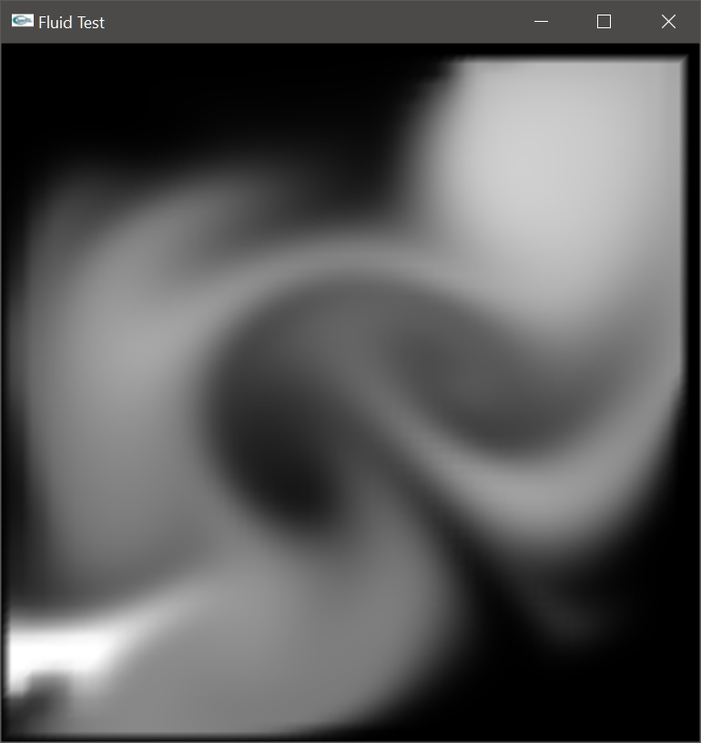

# JSFluid



|  |  |
|---|---|
| Author: | Davide Pasca |
| Platform: | OpenGL + glut |
| Build environment: | CMake |

## Overview

So far this is simply a refactoring of the source code that came with Jos Stam's 2003 [paper](http://www.autodeskresearch.com/publications/games)

## Required Tools
- [Git](https://git-for-windows.github.io/) with Git Bash
- [CMake](https://cmake.org/download/)
- For Windows: Visual Studio
- For Mac: Xcode
- For Linux: gcc, etc.

If you're on Windows. All commands are meant to run under Git Bash.

## Quick Start

### Do a full build
```bash
./build.sh
```
Executables can now be found under `_bin`.

### Using the VS solution
1. The solution is located in `_build\win\jsfluid.sln`
2. From *Solution Explorer*, right click on **Demo1** and choose *"Set As StartUp Project"*
3. Press F7 to build the selected project

### Updating the VS solution or makefiles
```bash
./build.sh -d
```
